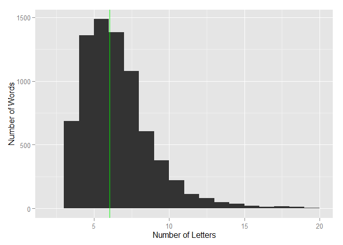

# Exploratory Text Mining Analysis with the R Package - tm
Chuan Zhang  
Friday, October 03, 2014  


Using three text files, this repository demonstrates how to use the functions I need for my projects from the package <code>tm</code> to explore and analyze text information.

<h4>Data source</h4> 
The data used in this repository is from a corpus called HC Corpora (www.corpora.heliohost.org). See the readme file at http://www.corpora.heliohost.org/aboutcorpus.html or the file <code>info.txt</code> in this repository for details on the corpora available.

<h4>Load Data</h4>
We can load the text data in different ways. For example, we can use <code>readLines</code>, <code>scan</code>, <code>Corpus</code> together with <code>readPlain</code> and many other functions. Here I am going to show in examples how to use these three functions.

The function <code>readLines</code> is from the <code>base</code> package, and it reads some or all text lines from a connection. The connection can be the path to a local text file, a complete url and some other objects. It returns a character vector, and its length is the number of lines read. Next, we load the file <code>Eng_US_Newspapers.txt</code> and briefly explore some information about this text file.


```r
file <- './data/Eng_US_Newspapers.txt'
tvec.news <- readLines(file)
```

```
## Warning in readLines(file): incomplete final line found on
## './data/Eng_US_Newspapers.txt'
```

```r
length(tvec.news)
```

[1] 77259

```r
sum(nchar(tvec.news))
```

[1] 17969650

It has 77,259 lines, and 17,969,650 characters in total. We can use the functions for vectors to manipulate this character vector. Now lets take a look at some of its lines.


```r
head(tvec.news, 3)
```

[1] "latimes.com\t2012/04/29\t1\t7,12\tHe wasn't home alone, apparently."                                                                                                                                            
[2] "stltoday.com\t2011/07/10\t1\t7,10\tThe St. Louis plant had to close. It would die of old age. Workers had been making cars there since the onset of mass automotive production in the 1920s."                   
[3] "freep.com\t2012/05/07\t1\t10\tWSU's plans quickly became a hot topic on local online sites. Though most people applauded plans for the new biomedical center, many deplored the potential loss of the building."

```r
tail(tvec.news, 3)
```

[1] "cleveland.com\t2012/02/29\t1\t10\t\"Given that there are no further tenders scheduled and the recent ECB rhetoric has been skewed toward this being the last, we believe the market will return to fundamentals and move away from this liquidity euphoria,\" analysts at Royal Bank of Scotland wrote in a research note."                                                                                                   
[2] "stltoday.com\t2011/04/13\t1\t13,17\tRipley's strong performance is complemented by Asa Somers as Diana's patient, or perhaps depressed, husband, and by Emma Hunton as their neglected teenage daughter, Natalie. A talented musician and student, Natalie is the most sympathetic character in \"Next to Normal,\" a girl trying to raise herself while her father cares for her mother and her mother is out of commission."
[3] "azcentral.com\t2008/08/01\t1\t3,4\tAt the Spice Merchant, a 2-ounce bag of tea leaves capable of producing 1"                                                                                                                                                                                                                                                                                                                 

Similar to <code>readLines</code>, <code>scan</code> is from the <code>base</code> package too, and we can set the argument <code>what="character"</code> to get the <code>scan</code> function return a character vector. Next, I use <code>scan</code> to load the same data.


```r
file <- './data/Eng_US_Newspapers.txt'
tvec.news <- scan(file=file, what="character")
length(tvec.news)
```

[1] 2561361

```r
sum(nchar(tvec.news))
```

[1] 15436299


Both <code>VCorpus</code> and <code>PCorpus</code> are from the <code>tm</code> package, and they create a <i>volatile</i> or <i>permanent corpus</i> respectively. Next, I demonstrate in one example how to use <code>VCorpus</code> to read the data file <code>Eng_US_Blogs.txt</code>. 


```r
library(tm)
ds  <- DirSource(directory="./data", encoding="UTF-8", mode="text")
txt <- VCorpus(ds, readerControl=list(reader=readPlain, language="la", load=TRUE))
```

<h4>Cleaning Data</h4>
After loading the text data into the memory, next step is to clean the text data, and prepare them for analysis. To clean data, first, we need to take a close look at the data loaded.


```r
summary(txt)
```

                      Length Class             Mode
Eng_US_Blogs.txt      2      PlainTextDocument list
Eng_US_Newspapers.txt 2      PlainTextDocument list
Eng_US_Twitter.txt    2      PlainTextDocument list

```r
data.blog <- VectorSource(txt[[1]])
names(data.blog$content)
```

[1] "content" "meta"   

```r
meta(data.blog$content)
```

Metadata:
  author       : character(0)
  datetimestamp: 2014-10-04 07:22:14
  description  : character(0)
  heading      : character(0)
  id           : Eng_US_Blogs.txt
  language     : la
  origin       : character(0)

```r
length(data.blog$content$content)
```

[1] 899288

```r
data.blog$content$content[1]
```

[1] "wordpress.com\t2012/03/26\t3\t0\tIn the years thereafter, most of the Oil fields and platforms were named after pagan ?gods?."    

```r
data.news <- VectorSource(txt[[2]])
names(data.news$content)
```

[1] "content" "meta"   

```r
meta(data.news$content)
```

Metadata:
  author       : character(0)
  datetimestamp: 2014-10-04 07:22:14
  description  : character(0)
  heading      : character(0)
  id           : Eng_US_Newspapers.txt
  language     : la
  origin       : character(0)

```r
length(data.news$content$content)
```

[1] 77259

```r
data.news$content$content[1]
```

[1] "latimes.com\t2012/04/29\t1\t7,12\tHe wasn't home alone, apparently."

```r
data.twit <- VectorSource(txt[[3]])
names(data.twit$content)
```

[1] "content" "meta"   

```r
meta(data.twit$content)
```

Metadata:
  author       : character(0)
  datetimestamp: 2014-10-04 07:22:14
  description  : character(0)
  heading      : character(0)
  id           : Eng_US_Twitter.txt
  language     : la
  origin       : character(0)

```r
length(data.twit$content$content)
```

[1] 2360148

```r
data.twit$content$content[1]
```

[1] "twitter.com\t2012/04/03\t0\t0\tHow are you? Btw thanks for the RT. You gonna be in DC anytime soon? Love to see you. Been way, way too long."

Clearly, all of the three text files have three columns, and the text are all in the third column. As in this repository, I am going to just demonstrate how use the functions mainly from the <code>tm</code> package to do text mining, I will focus on the third column in the third file (<code>Eng_US_Twitter.txt</code>). So next, I remove the other data from the memory, and start cleaning the text data with some typical transformations for text data cleaning.

<h5>data preprocessing</h5>


```r
rm(data.blog, data.news, ds, txt)
twits <- data.twit$content$content
twits <- twits[1:5000]
# 1 million tweets take around 150MB space
# 0.5 million tweets take around 78MB space
# 100 thousand tweets take around 16MB
twits <- strsplit(twits, '\t')
twits <- as.character(lapply(twits, function(x) x[5]))
twits <- gsub(pattern="[^a-zA-Z ,.!?\'\"]", replacement="", twits)
# summary(twits)
# head(twits,3)
# rm(data.twit)
```

<h5>data cleaning</h5>


```r
twits.vcorp <- VectorSource(twits)
twits.vcorp <- VCorpus(twits.vcorp)
# corpus of 1 million tweets take 3.6GB memory!!
# corpus of 0.5 million tweets take 1.8GB memory!!
# corpus of 100 thousand tweets take around 370MB memory!!
twits.vcorp <- tm_map(twits.vcorp, removePunctuation)
twits.vcorp <- tm_map(twits.vcorp, content_transformer(tolower))
twits.vcorp <- tm_map(twits.vcorp, removeWords, stopwords("english"))
twits.vcorp <- tm_map(twits.vcorp, removeWords, c("also", "but", "just",
                                                  "however", "just"))
twits.vcorp <- tm_map(twits.vcorp, stripWhitespace)
library(SnowballC)
twits.vcorp <- tm_map(twits.vcorp, stemDocument)
twits.vcorp <- tm_map(twits.vcorp, removeNumbers)
library(lava)
twits.vcorp <- tm_map(twits.vcorp, content_transformer(trim))
# after trimming, the 100 thousand twits only take 15MB
```

<h5>data analysis</h5>


```r
twits.tdm <- TermDocumentMatrix(twits.vcorp)
# findFreqTerms(x=twits.tdm, lowfreq=100)

twits.dtm <- DocumentTermMatrix(twits.vcorp)
# findFreqTerms(x=twits.dtm, lowfreq=100)

# findAssocs(twits.dtm, "back", corlimit=0.1)
```

<h5>data visualization</h5>


```r
library(Rgraphviz)
```

```
## Loading required package: graph
## Loading required package: grid
```

```r
plot(twits.dtm, terms=findFreqTerms(twits.dtm, lowfreq=100)[1:20], corThreshold=0.1)
```

 

```r
freq <- sort(colSums(as.matrix(twits.dtm)), decreasing=TRUE)
# head(freq, 14)
```


```r
library(wordcloud)
twits.m <- as.matrix(twits.tdm)
twits.v <- sort(rowSums(twits.m),decreasing=TRUE)
twits.d <- data.frame(word = names(twits.v),freq=twits.v)
# table(twits.d$freq)
pal2 <- brewer.pal(8,"Dark2")
png("./Examples_files/figure-html/word cloud-1.png", width=1280,height=800)
wordcloud(twits.d$word, twits.d$freq, scale=c(8,.2),
          min.freq=10, max.words=Inf, random.order=FALSE, 
          rot.per=.15, colors=pal2)
dev.off()
```

pdf 
  2 


<h5>quantitative analysis</h5>


```r
library(ggvis)
words <- twits.dtm %>%
    as.matrix %>%
    colnames %>%
    (function(x) x[nchar(x) < 20])
length(words)
```

[1] 7544

```r
head(words, 15)
```

 [1] "aaawww"  "aaiight" "aam"     "aap"     "aaron"   "abandon" "abbey"  
 [8] "abbi"    "abc"     "abcnew"  "abd"     "abil"    "abl"     "aboard" 
[15] "abound" 

```r
summary(nchar(words))
```

   Min. 1st Qu.  Median    Mean 3rd Qu.    Max. 
  3.000   4.000   6.000   6.061   7.000  19.000 

```r
library(ggplot2)
```

```
## 
## Attaching package: 'ggplot2'
## 
## The following object is masked from 'package:ggvis':
## 
##     resolution
## 
## The following object is masked from 'package:lava':
## 
##     %+%
## 
## The following object is masked from 'package:NLP':
## 
##     annotate
```

```r
data.frame(nletters=nchar(words)) %>%
    ggplot(aes(x=nletters)) +
    geom_histogram(binwidth=1) +
    geom_vline(xintercept=mean(nchar(words)),
    colour="green", size=1, alpha=.5) +
    labs(x="Number of Letters", y="Number of Words")
```

 

<h5>references</h5>

[1] Ingo F. (2014) "Introduction to the <strong>tm</strong> Package - Text Mining in <strong>R</strong>", cran.r-project.org/web/packages/tm/vignettes/tm.pdf

[2] Graham W. (2011) "Data Mining with Rattle and R", Springer: New York.

